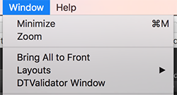
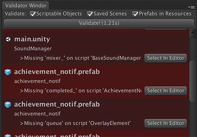
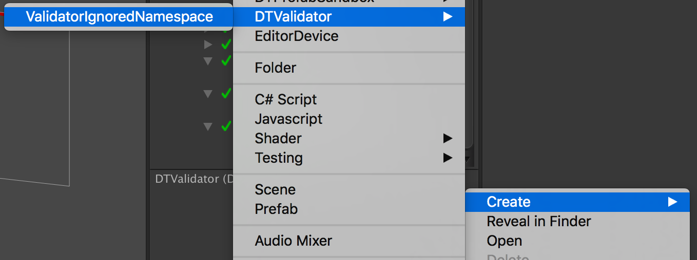

# DTValidator
Tool for validating (ensuring no broken / missing outlets) objects like GameObjects, ScriptableObjects, etc, in the Unity Editor.

More importantly, it's easy to set it up as a unit test for integration with your build pipeline.

### Why use DTValidator?
It's so easy to break outlets by renaming functions, removing assets, losing .meta files, etc. DTValidator finds missing outlets (any UnityEngine.Object exposed in the inspector), broken UnityEvents, and missing MonoBehaviour scripts.

[Read more about DTValidator here.](https://medium.com/@darrentsung/goodbye-missingreferenceexception-automated-validation-on-unity-projects-38bbb2fc7a1a)

## To Install & Use:
1. Download the DTValidator project from this repository by pressing [this link](https://github.com/DarrenTsung/DTValidator/archive/master.zip). It should automatically download the latest state of the master branch.
2. Place the downloaded folder in your project. I recommend placing it in the Assets/Plugins directory so [it doesn’t add to your compile time](https://medium.com/@darrentsung/the-clocks-ticking-how-to-optimize-compile-time-in-unity-45d1f200572b). 
3. Make a copy of [these](https://gist.github.com/DarrenTsung/b21d2645cf6e9519ac6f341d2f553eb1) validation unit tests in your project named `ValidationTests.cs` in your project under any Editor folder (default: `Assets/Editor`).

Now you have unit tests running to validate your project! Try running them by opening the `Test Runner` window under `Window->Test Runner`. It's likely that you'll have errors in your project - that's okay! Most likely the errors will be outlets that you need to mark `[Optional]`. See the  [`FAQ`](#faq) for the best approach to deal with these errors.

To find and fix these errors, open the `DTValidator Window` under `Window->DTValidator Window`.



Now press the `Validate` button and all the errors will show up. You can see where the error originated from and even highlight the object in the editor. Go through each error and determine if it’s an actual error or if it needs to be marked `[Optional]`.



Once you’re left with no errors, you’re done! Now set your build system to run unit tests for every build. You can now easily find and check new validation errors when they come up.

## FAQ

##### Q: I have an outlet marked as an error, but it's fine that the outlet is missing. How do I fix this?

A: Mark the outlet as `[DTValidator.Optional]` and the validator will ignore checking the field.

``` csharp
public class ExampleMonoBehaviour : MonoBehaviour {
	[DTValidator.Optional]
	public GameObject OptionalOutlet;
}
```
---
##### Q: There are a ton of optional outlets for this plugin I downloaded, is there an easier way to deal with these errors?

A: Yup! Mark the entire plugin namespace as optional by creating a `ValidatorIgnoredNamespace`. Right-click in your project and go to `Create->DTValidator->ValidatorIgnoredNamespace`.


---
##### Q (advanced): There's an outlet that is usually required, but in certain conditions it's optional.. can we handle that case?

A: Yep, though it'll take a bit of code. You can add define a function that determines whether the type / field combination should be validated. Here's an example:

``` csharp
using DTValidator;

// This attribute lets Unity know to call the static constructor
// when the Editor starts up, therefore injecting the predicate DontValidateIfMeshRenderer
[InitializeOnLoad]
public static class IgnoreMeshFilterSharedMeshWhenMeshRendererExists {
	static ValidateMeshFilterSharedMesh() {
		MemberInfo sharedMeshMember = ValidatorUnityWhitelist.GetPropertyFrom(typeof(UnityEngine.MeshFilter), "sharedMesh");
		ValidatorPredicates.RegisterPredicateFor(sharedMeshMember, DontValidateIfMeshRenderer);
	}

	private static bool DontValidateIfMeshRenderer(object obj) {
		UnityEngine.Component component = obj as UnityEngine.Component;
		if (component == null) {
			return true; // should validate
		}

		MeshRenderer meshRenderer = component.GetComponent<MeshRenderer>();
		// should validate (true) when meshRenderer does not exist
		return meshRenderer == null;
	}
}
```

---
##### Q (advanced): I found an error that the validator doesn't mark as an error!

A: Is it a field on a Unity component? By default, nearly all Unity components are ignored by the validator because you can't mark fields as `[Optional]`. But you can pick specific type / field combinations for the validator to validate. Here's an example:

``` csharp
using DTValidator;

// This attribute lets Unity know to call the static constructor
// when the Editor starts up, therefore injecting MeshFilter->sharedMesh to be validated
[InitializeOnLoad]
public static class ValidateMeshFilterSharedMesh {
	static ValidateMeshFilterSharedMesh() {
		Type meshFilterType = typeof(UnityEngine.MeshFilter);
		MemberInfo sharedMeshMember = ValidatorUnityWhitelist.GetPropertyFrom(meshFilterType, "sharedMesh");
		ValidatorUnityWhitelist.RegisterWhitelistedTypeMember(meshFilterType, sharedMeshMember);
	}
}
```

##### Q (cont): It's not a field on a Unity component!
A: [Open an issue](https://github.com/DarrenTsung/DTValidator/issues) with your specific case and I'll take a look at it :grin:.

---

Don't see your question answered here? [Open an issue!](https://github.com/DarrenTsung/DTValidator/issues)
